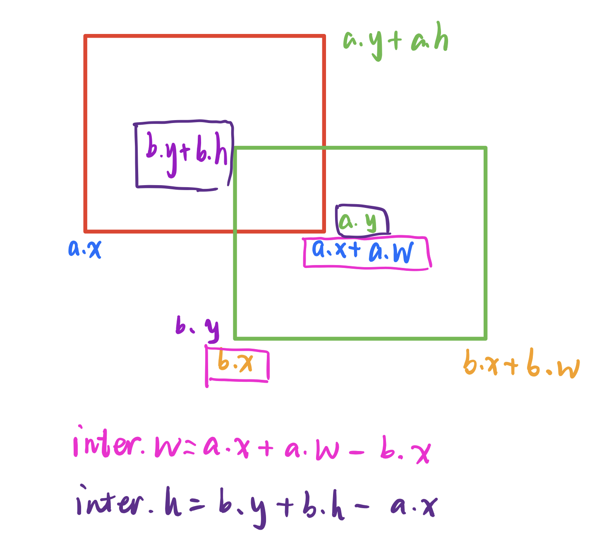

# IoU

IoU全称为Intersection over union。是目标检测中重要的性能指标。

计算方法如下：

注意：这里的候选框的左下角为起点坐标\(x, y\)

ref:[https://blog.csdn.net/briblue/article/details/91366128](https://blog.csdn.net/briblue/article/details/91366128)

