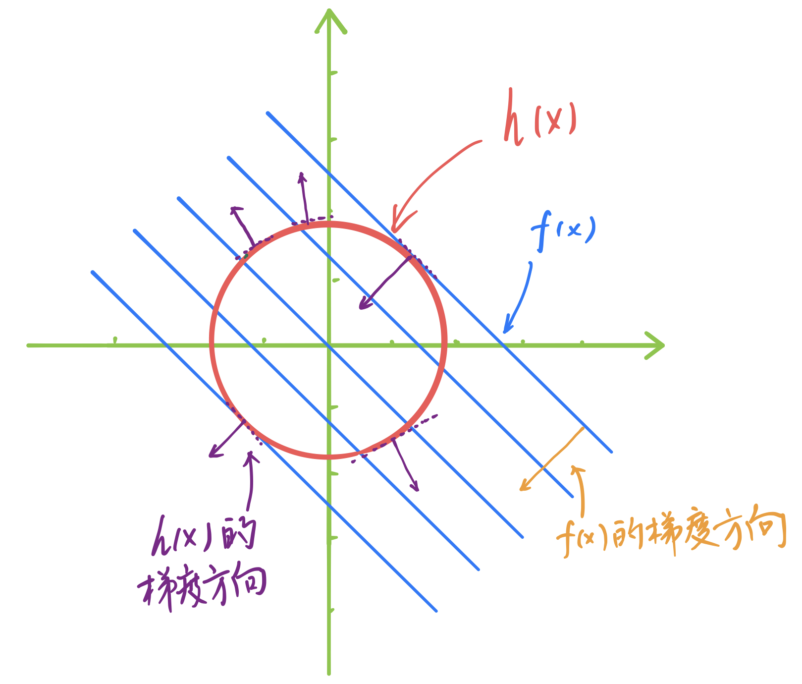
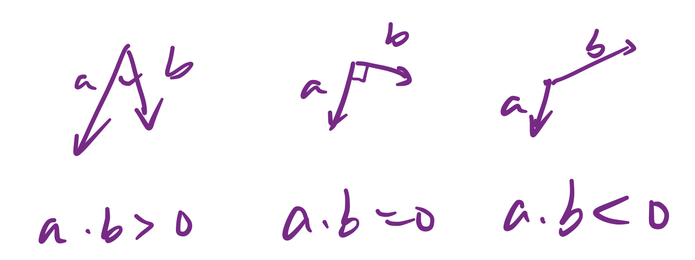
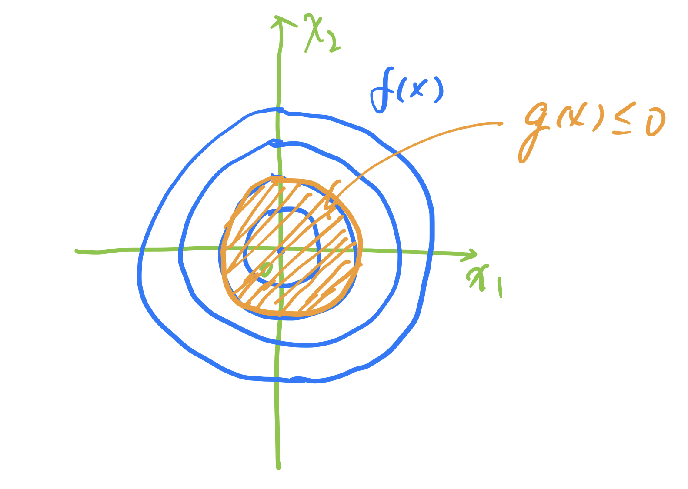
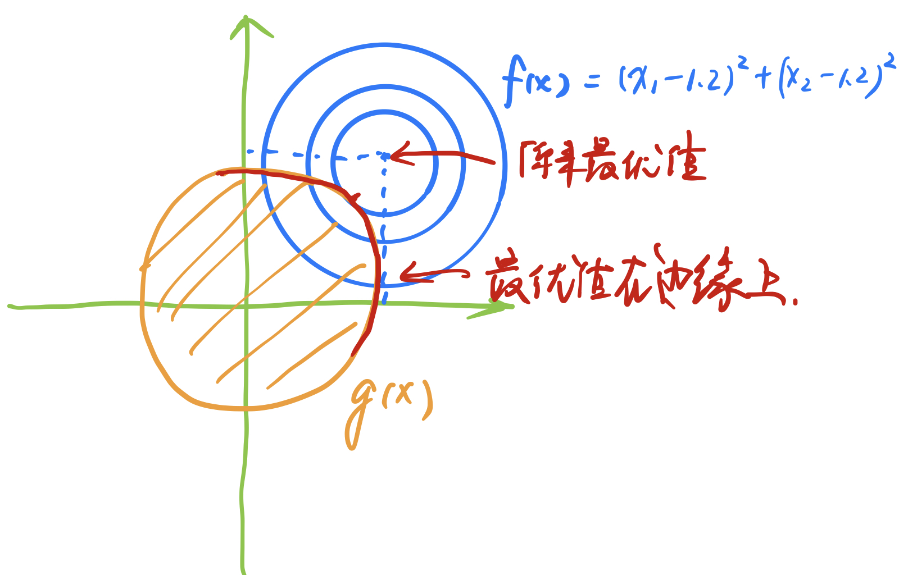

# 拉格朗日乘子法和KKT条件

拉格朗日乘子法用于有条件的优化，具体的优化的场景如下：

$$
\begin{align} 
min&\ f(x) \\
s.t.&\  h(x) = 0 \\
      &\ g(x) \leq 0
\end{align}
$$

## 无约束条件

这个场景下就是我们平常求的函数极值问题，可以直接使用求导方式，根据导数为0的来判断函数极值，举个简单的例子：

$$
f(x) = x^2
$$

可以很容易得到函数的导数$$f^{'}(x) = 2x =0$$ ，并且我们另其等于0，最终可以得到在$$x= 0$$ 出取得函数的最小值。

无约束的条件的极值求解是比较容易的。

## 等式约束条件

这里我们需要分情况讨论，首先我们来看条件为$$h(x)=0$$的情况，例子如下：

$$
\begin{align} 
min&\ f(x)=x_1 + x_2\\
s.t.&\  h(x) = x_1^2 + x_2^2 - 2 = 0 \\
\end{align}
$$

首先我们可以绘制出$$f(x)=x_1+x_2$$的等高线，**等高线的概念是指在这条线上，**$$f(x)$$**的函数值是一样的**，如图中的 线所示，接下来对$$f(x)$$进行求导$$\nabla f(x)$$，得到下面的结果：

$$
\frac{\partial f(x_1, x_2)}{\partial x_1} = 1\\
\ \\
\frac{\partial f(x_1, x_2)}{\partial x_2} = 1 \\
$$

所以最终我们得到$$f(x)$$的导数为：

$$
\nabla f(x) = \begin{pmatrix} 1 \\ 1  \end{pmatrix}
$$

对应的是图1中橙色的向量。

下面我们看下$$\nabla h(x)$$

$$
\frac{\partial h(x_1, x_2)}{\partial x_1} = 2x_1\\
\ \\
\frac{\partial h(x_1, x_2)}{\partial x_2} = 2x_2 \\
$$

最终得到的$$h(x)$$的导数为

$$
\nabla h(x) = \begin{pmatrix} 2x_1 \\ 2x_2  \end{pmatrix}
$$

这里对应的图1中紫色的向量，这个向量是垂直于圆周边缘的切线，沿着法线的方向。

那么现在我们的优化问题是什么呢，从图上可以看出，该问题就转化为在红色的圆上找一点，使得$$f(x)$$的值最小，显然，从图上可以看到在第一象限和第四象限中中紫色切线的位置对应着$$f(x)$$的极值，显然在第一象限中对应的是最大值，第四象限是最小值，这个最小值就是我们要找的。

梯度对应的是函数下降最快的方向，沿着梯度的正方向是函数增加最快的方向，负方向是函数减小最快的方向，那么现在我们要保证的每一次的递进都是沿着函数梯度减小的方向，需要满足一定的条件，从圆上 的任选一点$$x_0$$，然后取一个很小的数值$$\Delta{x}$$，要满足的条件如下：

$$
f(x_0 + \Delta{x}) < f(x_0)
$$

因为要求的是$$f(x)$$的最小值，所以移动了$$\Delta{x}$$之后的值要小于原来的值。

那么要如何保证这个成立呢？

$$
\Delta{x}\cdot(-\nabla_xf(x)) > 0
$$

这个是什么意思呢，涉及到向量的点乘问题，如下图：

当满足向量点乘大于0的时候，两个向量处于相同的方向。满足上面的式子我们就可以保证是沿着梯度下降的方向。

$$
\vec{a}\cdot\vec{b} = \|\vec{a}\|\|\vec{b}\|cos\theta
$$

回到对约束条件的$$h(x)$$求导，对应的是梯度是图中紫色的方向，可以看到它是沿着边缘切线垂直的方向，也就是沿着法线的方向。可以得到下面这个式子：

$$
\Delta{x}\bot\nabla_xh(x)
$$

同样我们可以得到，下面两个式子：

$$
h(x_0 + \lambda\Delta{x}) = 0 \\
\\
\Delta{x}\cdot(\nabla_x{h(x)}) = 0
$$

第一个式子显然成立，我们是在圆上找最小的点，第二个式子是因为两个向量垂直，那么它们的点乘结果为0。

现在我们来看最优的点位于第四象限，可以很直观得到最优的情况下，$$f(x)$$和$$h(x)$$两个函数的梯度是平行的，平行向量之间是满足一定的数量关系，也就是说满足如下等式：

$$
-\nabla{f(x)} = \lambda{\nabla{h(x)}}
$$

最后我们得到上面这个结论，二者的梯度满足一定的数量关系，其中$$\lambda > 0$$。

回想我们的使用拉格朗日乘子法时，首先设了朗格朗日函数：

$$
L(x)= f(x) + \lambda{h(x)}
$$

然后对拉格朗日函数求导：

$$
\frac{\partial{L}}{\partial{x}} = \nabla_x{f(x)} + \lambda{\nabla_x{h(x)}} = 0 \\
\ \\
\frac{\partial{L}}{\partial{\lambda}} =  h(x) = 0
$$

可以得到，第一个式子就是我们上面根据图示得到的式子，而第二个式子是我们要求的约束条件。

这样就解释了为什么我们要以那样的形式来设置拉格朗日函数。

## 不等式约束条件

现在我们来看不等式的约束方式。不等式的约束我们要分为两种情况来讨论：

### 第一种情况

这种情况是函数$$f(x)$$的最优解是包含在限定范围内的，例子如下：

$$
\begin{align} 
min&\ f(x) = x_1^2 + x_2^2\\
s.t.&\  g(x) = x_1^2 + x_2^2 - 1 \leq 0 \\
\end{align}
$$

这个场景下从下图的示例中可以看到，$$f(x)$$的最小值是包含在$$g(x)$$所限定的取值范围内的，所以这个场景下我们只需要对$$f(x)$$求导，然后令其为0就可以了，解出相应的$$x^*$$ ，带入$$f(x)$$即为最小值。

### 第二种情况

这种情况是说最优解是在限定范围之外的，例子如下：

$$
\begin{align} 
min&\ f(x) = (x_1 + 1.2)^2 + (x_2 + 1.2)^2\\
s.t.&\  g(x) = x_1^2 + x_2^2 - 1 \leq 0 \\
\end{align}
$$

这个时候我们可以看到，$$f(x)$$的理论上的最优解是在限定函数$$g(x)$$的可取区域之外的，$$f(x)$$的等高线向外延伸时，$$f(x)$$的值是越来越大，当等高线和限定函数$$g(x)$$的边界相切的时候，$$f(x)$$取到它的最小值。

所以这个时候我们就把不等式的约束条件转化成了等式的约束条件，在$$g(x) = 0$$的边界上找到$$f(x)$$的最优解。

由**第一种情况**和**第二种情况**共同构成了不等式约束的所有求解情况。

## KKT条件

首先呢，明确下KKT条件是用于不等式约束的极值求解问题。

KKT条件如下：\(1\) ~ \(4\)

$$
\nabla_xL(x^*,\lambda^*) = 0 \tag{1}
$$

这个条件对应的就是$$-\nabla{f(x)} = \lambda{\nabla{h(x)}}$$

$$
\lambda^*\geq0 \tag{2}
$$

保证的是$$-\nabla{f(x)} = \lambda{\nabla{h(x)}}$$这两个向量是同一个方向的

$$
\lambda^*\cdot{g(x^*)}=0 \tag{3}
$$

这个式子要分两种情况来看，当$$\lambda^*=0$$时，$$L(x) = f(x)$$，对应的是第一种情况，此时没有约束条件，最优解就是$$f(x)$$的最优解；当$$g(x) = 0$$的时候，对应的就是第二种情况，最优解在$$g(x)$$的边界。

$$
g(x^*) \leq 0 \tag{4}
$$

这个条件就是我们的限制条件。

## 参考文献

* \[1\]秦曾昌.机器学习算法精讲.小象学院，2018.

